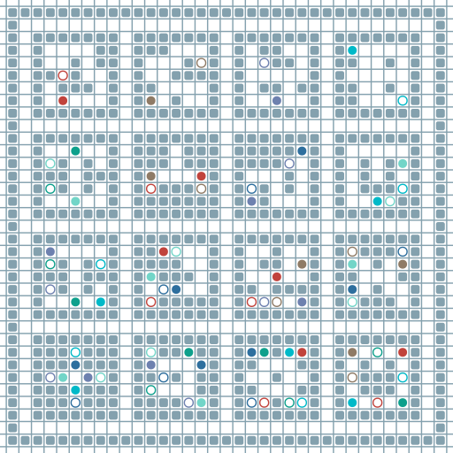

# MAPF-GPT: Imitation Learning for Multi-Agent Pathfinding at Scale


<div align="center" dir="auto">
   <p dir="auto"></p>


---

[](https://colab.research.google.com/drive/1NMMv89QBUJA_xkYSy2QZKTxHoRxzwqSk?usp=sharing)
[](https://github.com/CognitiveAISystems/MAPF-GPT/blob/main/LICENSE)
[](https://arxiv.org/abs/2409.00134)
[](https://huggingface.co/aandreychuk/MAPF-GPT/tree/main)
[](https://huggingface.co/datasets/aandreychuk/MAPF-GPT/tree/main)
</div>

The repository consists of the following crucial parts:

- `example.py` - an example of code to run the MAPF-GPT approach.
- `benchmark.py` - a script that launches the evaluation of the MAPF-GPT model on the POGEMA benchmark set of maps.
- `generate_dataset.py` - a script that generates a 1B training dataset. The details are provided inside the script in the main() function.
- `download_dataset.py` - a script that downloads 1B training dataset and 1M validation one. The dataset is uploaded to Hugging Face.
- `train.py` - a script that launches the training of the MAPF-GPT model.
- `eval_configs` - a folder that contains configs from the POGEMA benchmark. Required by the `benchmark.py` script.
- `dataset_configs` - a folder that contains configs to generate training and validation datasets. Required by the `generate_dataset.py` script.

## Installation

It's recommended to utilize Docker to build the environment compatible with MAPF-GPT code. The `docker` folder contains both `Dockerfile` and `requirements.txt` files to successfully build an appropriate container.

```
cd docker & sh build.sh
```

## Running an example

To test MAPF-GPT, you can simply run the `example.py` script. By default, it uses the MAPF-GPT-2M model, but this can be adjusted.  
Additionally, there is a list of optional arguments: `--map_name`, `--device`, `--num_agents`, `--seed`, `--max_episode_steps`, `--model`, `--show_map_names`. The `--map_name` argument allows you to select a map from those available in the `eval_configs` folder. To list all available maps, you can provide the `--show_map_names` option or look inside `eval_config` folder. Here are a few examples from each set: `validation-random-seed-000`, `validation-mazes-seed-000`, `wfi_warehouse`, `Berlin_1_256_00`, `puzzle-00`.  

It is recommended to use GPU-accelerated setups; however, smaller models can be run on a CPU. For Apple Silicon machines, it's recommended to use `--device mps`, which significantly speeds up inference.  
You can choose from `2M`, `6M`, and `85M` model sizes, which will be automatically downloaded from Hugging Face. Be aware that the 85M model requires 1 GB of disk space.


Here is an example of running MAPF-GPT-2M on a maze map:
```
python3 example.py --map_name validation-mazes-seed-000 --model 2M --num_agents 32
```


Here is an example of running MAPF-GPT-85M on `wfi_warehouse` map:
```
python3 example.py --map_name wfi_warehouse --model 85M --num_agents 192
```

In addition to statistics about SoC, success rate, etc., you will also get an SVG file that animates the solution found by MAPF-GPT, which will be saved to the `svg/` folder.


## Running evaluation

You can run the `benchmark.py` script, which will run both MAPF-GPT-2M and MAPF-GPT-6M models on all the scenarios from the POGEMA benchmark.
You can also run the MAPF-GPT-85M model by setting `path_to_weights` to `weights/model-85M.pt`. The weights for all models will be downloaded automatically.

```
python3 benchmark.py
```

The results will be stored in the `eval_configs` folder near the corresponding configs. They can also be logged into wandb. The tables with average success rates will be displayed directly in the console.

## Dataset

To train MAPF-GPT, we generated a training dataset consisting of 1 billion tensor-action pairs (specifically, 1,000 * 2^20). We used the LaCAM approach as the source of expert data. 90% of the data in the dataset was obtained from maze maps, while the remaining 10% was sourced from random maps. It requires 256 GB of disk space and is divided into 500 files, each containing 2^21 tensor-action pairs and occupying 522 MB of disk space. Additionally, there is a small validation dataset with 2^20 tensor-action pairs, obtained from maps not included in the training dataset. The validation dataset has a 1:1 ratio of mazes to random maps, compared to a 9:1 ratio in the training dataset.

### Downloading dataset

The dataset is available on the Hugging Face Hub. You can download it using the `download_dataset.py` script. Adjust the number of files downloaded to manage disk space if you don't need the entire 1 billion train dataset.

```
python3 download_dataset.py
```

### Generating the dataset

If you want to generate the dataset from scratch or create a modified version, use the provided script. It handles all necessary steps, including instance generation (via POGEMA), solving instances (via LaCAM), generating and filtering observations, shuffling the data, and saving it into multiple `.arrow` files for efficient in-memory operation.

```
python3 generate_dataset.py
```

Please note that generating the full training dataset of 1 billion observation-action pairs requires 256 GB of disk space, plus approximately 20 GB for temporary files. Additionally, solving all instances with LaCAM takes significant time. You can reduce the time and space needed, as well as the final dataset size, by modifying the configuration files in `dataset_configs` (e.g., adjusting the number of seeds or reducing the number of maps).

## Running training of MAPF-GPT

To train MAPF-GPT from scratch or to fine-tune the existing models on other datasets (if you occasionally have such ones), you can use the `train.py` script. By providing it a config, you can adjust the parameters of the model and training setup. The script utilizes DDP, which allows training the model on multiple GPUs simultaneously. By adjusting the `nproc_per_node` value, you can choose the number of GPUs that are used for training.

```
torchrun --standalone --nproc_per_node=1 train.py gpt/config-6M.py
```

## Citation:

```bibtex
@inproceedings{andreychuk2025mapf,
  title={{MAPF-GPT}: Imitation learning for multi-agent pathfinding at scale},
  author={Andreychuk, Anton and Yakovlev, Konstantin and Panov, Aleksandr and Skrynnik, Alexey},
  booktitle={Proceedings of the AAAI Conference on Artificial Intelligence},
  volume={39},
  number={22},
  pages={23126--23134},
  year={2025}
}
```
